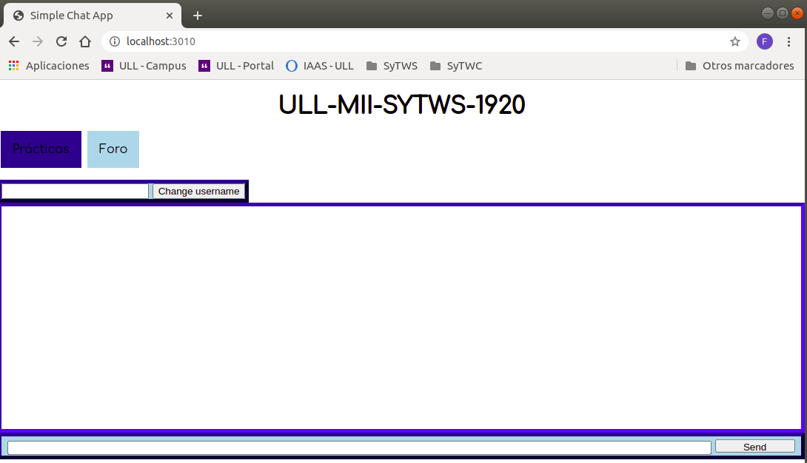

# **Práctica 5**
## Websocket

### Simple APP Chat 

Despliegue de una aplicación de chat en HerokuApp e IAAS-ULL

### Test local

Se clona el repositorio y ajusta a las necesidades. Posterior, se lanza la aplicación:

```
npm install
npm start
```



### HerokuApp

La instalación se ha realizado a través de la guía oficial para [Node.js](https://devcenter.heroku.com/articles/getting-started-with-nodejs)

Instalación de Heroku

```
sudo snap install heroku --classic
```

Login a tráves de navegador

```
heroku login
```

Crear la aplicación
```
heroku create
```

Desplegar aplicación
```
git push heroku main
```

Ver el resultado del despliegue
```
heroku open
```

https://chat-sytws.herokuapp.com/

### IAAS ULL